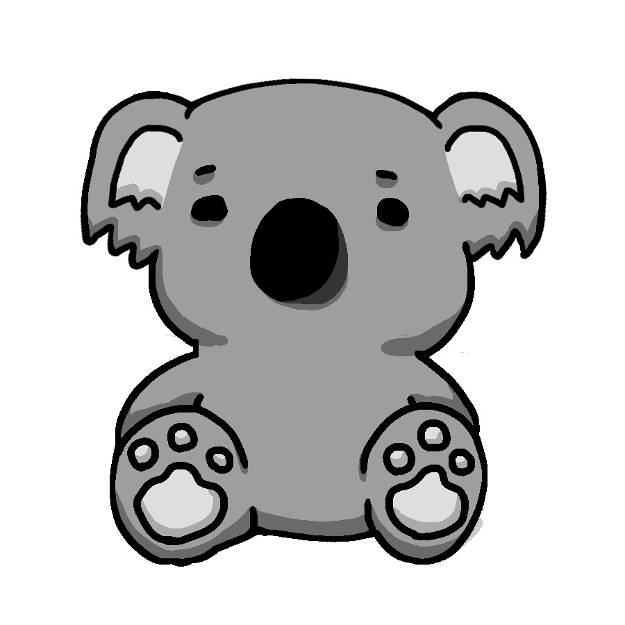
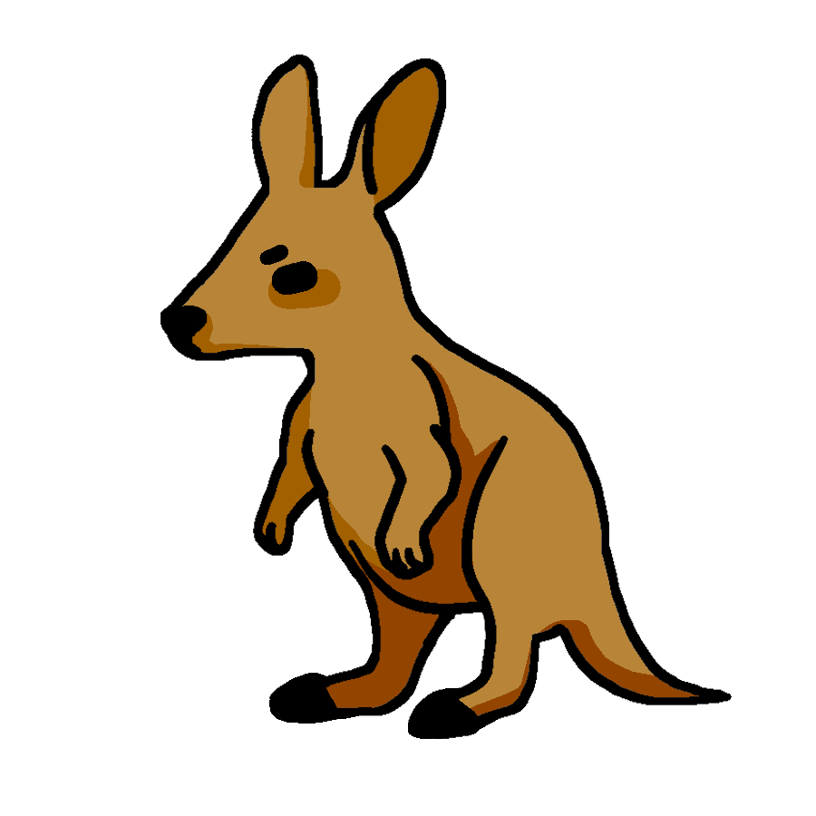
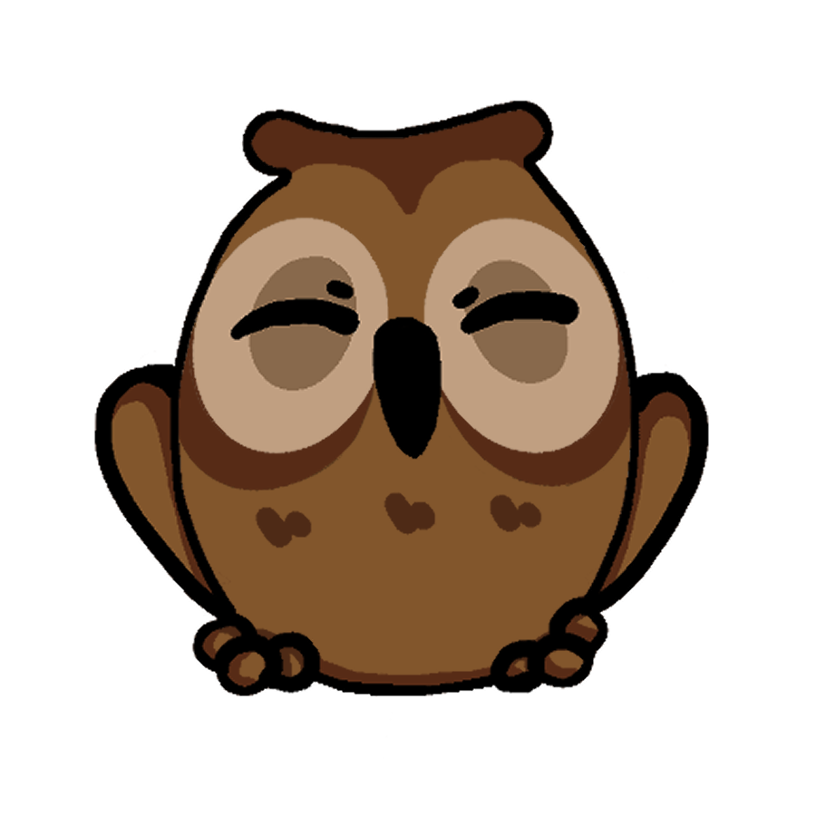

# Anicode
Produce by NTPU2021 - Software Engineering Group 1

## 介紹
我們開發了一款遊戲以程式設計為基礎，並加入競技與娛樂的性質，用來培養程式邏輯與素養。

## 環境

### 開發
`Windows 10` `Unity 2020.3.22` `Visual Studio 2019`

### 執行
`Windows 10` `單一區域私人網路(雙人模式需求)`

## 遊戲內容概要

### 角色
||狐狸|無尾熊|袋鼠|鯨魚|貓頭鷹|
|---|---|---|---|---|---|
|圖示||||||

### 模式
* 劇情模式
* 挑戰模式
* 雙人模式

### 基本功能
* 成就系統
* 金幣系統
* 商店系統
* 圖鑑系統

## 開發人員
林均彥、黃彥博、邱信瑋、梁祐銘、溫佩旻、周書愷、池秉宸
